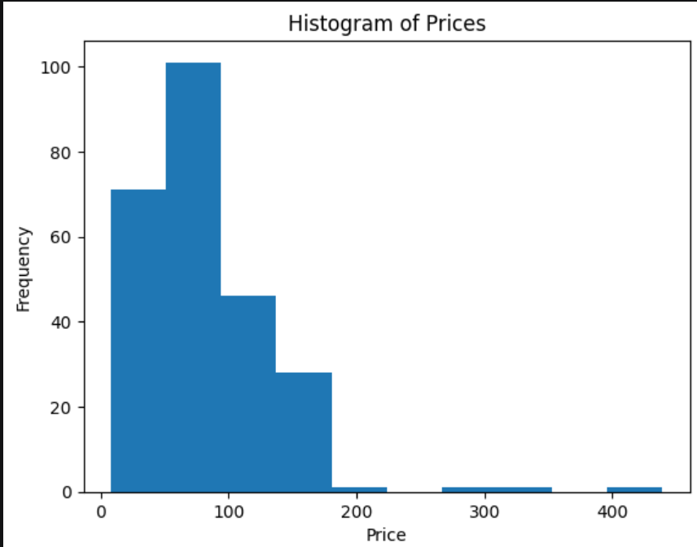
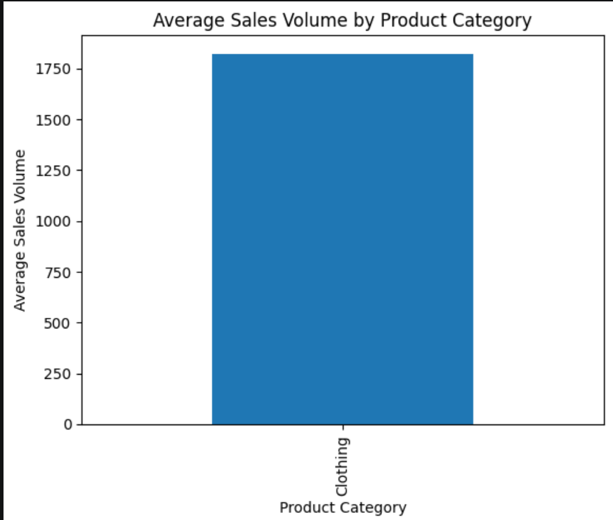
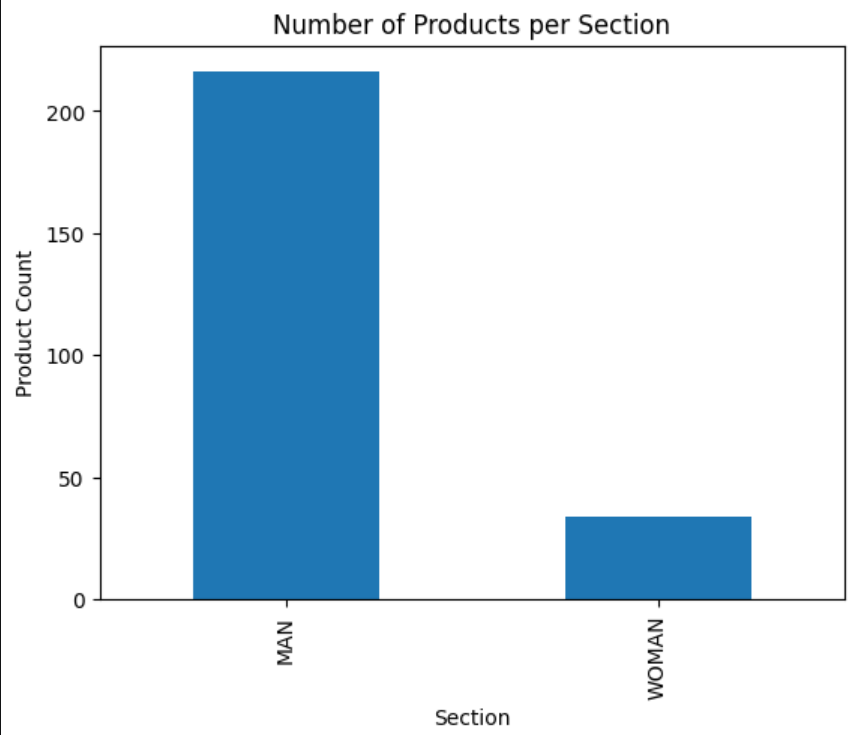
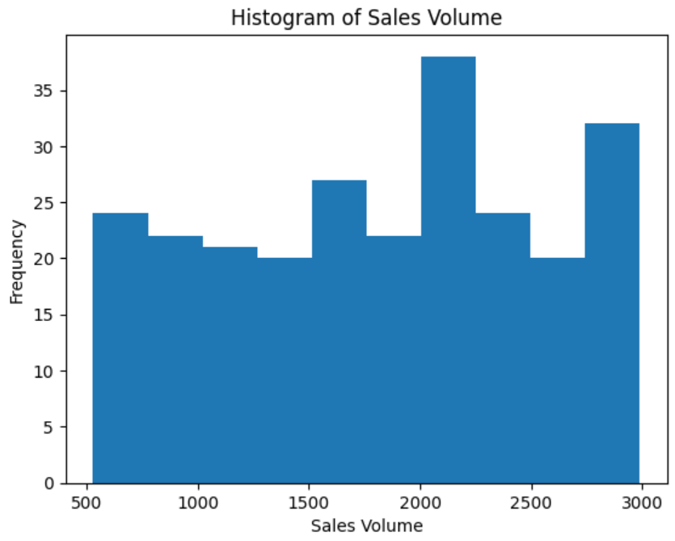

# Zara Data Analysis

## Description

Ce projet consiste à analyser les données d'une boutique Zara afin d'explorer les produits, les prix et leurs caractéristiques, et d'identifier des informations utiles à partir des données.

## Objectifs du projet

* Comprendre la structure des données
* Nettoyer et préparer les données
* Effectuer une analyse exploratoire
* Identifier les tendances et les relations entre les variables
* Créer des visualisations pour faciliter l'interprétation
* Extraire des insights à partir des données

## Étapes de l'analyse

### 1. Collecte et exploration des données

* Importation des données
* Exploration du dataset
* Analyse des types de variables
* Statistiques descriptives

### 2. Traitement des données

* Gestion des valeurs manquantes
* Recherche des doublons
* Détection et traitement des valeurs aberrantes
* Transformation des variables
* Préparation des données pour l'analyse

### 3. Analyse des données

Analyse des différentes caractéristiques des produits Zara afin de mieux comprendre les données et d'identifier les tendances importantes.

##  Visualisations

### 1. Histogram of Prices

Distribution des prix des produits Zara.



### 2. Average Sales Volume by Product Category

Comparaison du volume moyen des ventes selon les différentes catégories de produits.



### 3. Number of Products per Section

Répartition du nombre de produits selon les différentes sections du catalogue Zara.



### 4. Histogram of Sales Volume

Distribution du volume des ventes des produits.




## Résultats et visualisations

L'analyse des données Zara permet de mieux comprendre les caractéristiques des produits, leur répartition et les différentes tendances présentes dans le dataset.

### Principaux résultats

* Analyse de la distribution des prix des produits.
* Identification des catégories de produits les plus représentées.
* Comparaison des caractéristiques des différents produits.
* Analyse des relations entre les variables disponibles.
* Détection des tendances et des différences entre les catégories.
* Utilisation de statistiques descriptives pour mieux comprendre les données.

### Visualisations

Plusieurs visualisations ont été réalisées afin de faciliter l'interprétation des résultats :

*  Distribution des prix
*  Répartition des produits par catégorie
*  Comparaison des produits
*  Analyse de la distribution des variables
*  Analyse des relations entre les variables

Les graphiques permettent de transformer les données brutes en informations facilement interprétables et de mettre en évidence les principales tendances du catalogue Zara.

###  Insights

L'analyse permet notamment d'identifier :

* les catégories contenant le plus de produits ;
* la répartition des prix ;
* les produits présentant des caractéristiques particulières ;
* les relations éventuelles entre les différentes variables ;
* les tendances générales du catalogue analysé.

> Les résultats détaillés et les visualisations sont disponibles dans le notebook `zara_analysis.ipynb`.


## Technologies utilisées

* Python
* Pandas
* NumPy
* Matplotlib
* Seaborn
* Jupyter Notebook

## Structure du projet

```text
zara-data-analysis/
│
├── zara_analysis.ipynb
├── README.md
└── data/
```

## Résultats

L'analyse permet d'identifier les principales caractéristiques des produits Zara et de mieux comprendre les tendances présentes dans les données.

## Auteur

**Ahlam**

Future Data Analyst | AI Student
Ce projet fait partie de mon parcours d'apprentissage en Data Analysis et Intelligence Artificielle.
